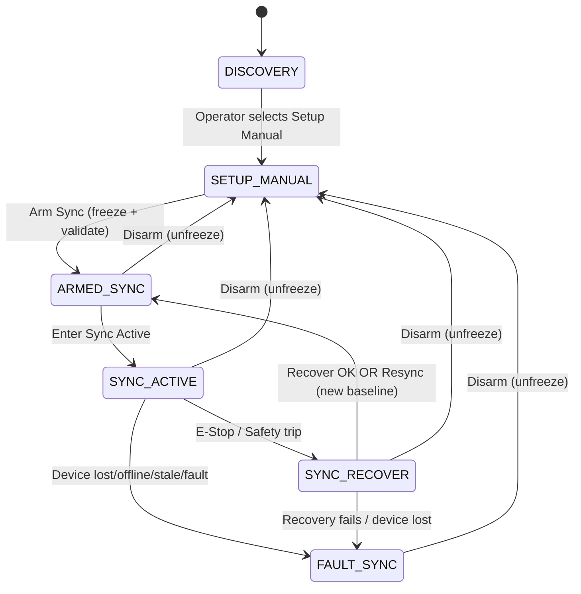

# Boot to Sync to Recover/Resync

This document describes the **canonical operational workflow** for Steuerung3D from **power-on** through **pairing**, **setup/manual rigging**, **synchronized motion**, and **E‑Stop recovery** (Recover-to-last-good or Resync).

It is written to remain valid under these variations:
- Core starts first or last
- HiPs start first or last
- Densis can be added/removed during setup
- Once synchronized, the configuration is **frozen**

---

## Glossary

- **Densi**: A PLC/winch controller (typically **one winch per Densi**) broadcasting telemetry.
- **Core**: Central coordinator. Maintains registry, claims/pairing, rig configuration, kinematics, global rig state.
- **HiP**: Operator UI instance. Starts unbound; can claim/pair with a Densi during setup.
- **Rig config**: Participating devices (winches), anchor positions in space, kinematics type, limits, frame definition.
- **Frozen config**: From *ARMED_SYNC* onward: participating set + anchors + kinematics parameters are locked.

---

## Global rig states

### States
- **DISCOVERY** — dynamic; devices/HiPs come and go; no motion or limited motion.
- **SETUP_MANUAL** — dynamic; direct winch jog allowed for paired devices.
- **ARMED_SYNC** — **frozen config**; strict validation; motion commanded = 0.
- **SYNC_ACTIVE** — **frozen config**; kinematics active; cartesian motion intents accepted.
- **SYNC_RECOVER** — **frozen config**; post‑E‑Stop stop/recover/resync procedure.
- **FAULT_SYNC** — **frozen config**; motion inhibited; operator must explicitly disarm/unfreeze.

### What “frozen” means
While in **ARMED_SYNC / SYNC_ACTIVE / SYNC_RECOVER / FAULT_SYNC**:
- Participating device set cannot change (no “adding a winch to the rig”)
- Anchors cannot be edited
- Kinematics type/parameters cannot be edited
- Claims/pairing for participating devices cannot be changed
- Manual jog (`JogWinch`) is not accepted (except as part of controlled recovery logic owned by core)

> Non-participating devices may still appear in the registry; they are not eligible for claims into the frozen rig until the operator disarms back to setup.

---

## State diagram (high level)

---

## Network/process boot sequence (order independent)

### 1) Densis boot
- Each Densi boots and begins broadcasting telemetry immediately (heartbeat + status + measured values).
- Densis may be powered on later (during setup) and should auto‑appear in the registry.

**Telemetry MUST include at least:**
- `device_id` (stable unique)
- `human_name` (optional, e.g. "Anton")
- `tick` / `last_seen`
- `fault flags`, `estop`, `enabled`
- `pos`, `vel` (and optionally `amp`, `temp`)
- limits (`HardMin/Max`, `UserMin/Max`)
- firmware/build version (optional)

### 2) Core boot
- Core listens for telemetry and maintains a **Device Registry**:
  - devices online + last_seen age
  - fault/estop flags
  - claim status (unclaimed / claimed by hip_id)
  - “participating in rig” (yes/no)
- Core periodically publishes registry snapshots/deltas to HiPs.

### 3) HiP boot
- HiP starts **unpaired**.
- HiP subscribes to core’s registry feed; `cmbAxis` lists available Densis.
- If core is not yet online, HiP shows “core offline” and retries.

---

## Pairing (claim / release)

### Goal
Allow an operator to associate a HiP instance with a specific Densi for **setup** without risking double-control.

### Steps
1. Operator selects a Densi in `cmbAxis`.
2. HiP sends `ClaimDevice(device_id, hip_id)` to core.
3. Core grants claim only if unclaimed (or previous lease expired).
4. Core broadcasts updated registry/claim state.
5. HiP shows “Connected: <device>” and enables setup controls.

### Release
- HiP can release explicitly: `ReleaseDevice(device_id, hip_id)`
- Core may auto‑release if HiP disappears (optional lease).

---

## Rig configuration (dynamic, before freeze)

### 1) Select participating winches
- Operator ensures the intended winches are online (typically 4 corners).
- Core (or a setup panel) marks these Densis as **participating**.

### 2) Assign anchor positions
For each participating Densi:
- Assign `anchor_xyz` in rig coordinates (meters).
- Core validates:
  - all required anchors exist
  - no duplicates
  - geometry solvable for chosen kinematics type

Until valid: rig status = **incomplete** (cannot arm sync).

---

## Setup and rigging (SETUP_MANUAL)

### Enter SETUP_MANUAL
- Operator selects *Setup Manual*.
- Configuration is still dynamic (devices can appear/disappear; anchors editable).

### Manual jog
- HiP emits direct commands for its paired Densi only:
  - `JogWinch(device_id=<paired>, rate_mps=...)`
- Core accepts `JogWinch` only when:
  - state == `SETUP_MANUAL`
  - device is claimed by that HiP
  - safety chain OK (E‑Stop clear, SafetyPLC allow motion, etc.)

### Operator actions in setup
- Adjust rope lengths to bring the hook point to the central mount position.
- Attach the camera/load.
- Balance the load.

---

## Freeze and validate (ARMED_SYNC)

### Arm Sync = “commit point”
- Operator presses **Arm Sync**.
- Core transitions to **ARMED_SYNC** and snapshots **RigSyncConfig**:
  - participating device_ids
  - anchor positions
  - kinematics type + params
  - limits
  - frame definition (if used)

From this point the config is **frozen**.

### Strict validation at arm
Core validates:
- all participating devices online, telemetry fresh
- no faults / estop clear
- commanded rates are zero
- kinematics solvable

If any check fails:
- Core rejects arm and stays in `SETUP_MANUAL` with reasons displayed.

---

## Synchronized motion (SYNC_ACTIVE)

### Enter SYNC_ACTIVE
- Operator enters *Sync Active* from *Armed Sync*.
- Manual jog is now rejected; only cartesian motion is accepted.

### Live control intent contract
- HiP (or the joystick policy layer) sends:
  - `JogCartesian(vx, vy, vz)` (m/s in rig coordinates)
- Core performs kinematics:
  - cartesian rates → per‑winch rope rate commands
- Core enforces limits (cartesian and per‑winch).

### Dynamic changes are not allowed in SYNC_ACTIVE
- No changes to participating set
- No pairing changes
- No anchor edits
- No device additions/removals into the rig set

---

## E‑Stop / safety trip during sync → controlled stop + SYNC_RECOVER

### Trigger
While in `SYNC_ACTIVE`, an E‑Stop/safety trip occurs.

### Stop behavior (fast but not slamming)
- Core commands a **rapid controlled deceleration** to zero winch rates:
  - using configured `a_emergency` (rope‑rate decel)
- SafetyPLC may also cut drive power; core still transitions deterministically.

### Why recovery is needed
Because each winch stops slightly differently, measured rope lengths can drift out of coherence.
After stop:
- rope lengths may no longer match a consistent “pose” expected by the kinematics

Core transitions to **SYNC_RECOVER** once stopped (or after timeout).

---

## SYNC_RECOVER: Recover to last good OR Resync

In SYNC_RECOVER the rig remains **frozen** but operator chooses how to restore coherence.

### Last known good snapshot
During SYNC_ACTIVE, core maintains `last_good`:
- timestamp
- measured rope lengths per participating winch: `L_good[winch_id]`
- optionally estimated pose

Core updates `last_good` only when:
- sync is healthy (no faults, telemetry fresh)
- (recommended) rates are stable / within sanity bounds

---

### Option A — Recover to last known good
**Use when:** you want to restore the exact previous coherent state.

1. Operator clears E‑Stop; safety chain OK again.
2. Operator presses **Recover to last good**.
3. Core drives each winch toward `L_good[winch_id]` using controlled profile:
   - `v_recover`, `a_recover`, optional jerk limit
4. Core monitors convergence:
   - succeed when all `|L_measured - L_good| < tol`

**Exit:** Core returns to **ARMED_SYNC** (still frozen, motion zero). Operator can re-enter SYNC_ACTIVE.

---

### Option B — Resync (operator override)
**Use when:** current state is acceptable and you want to continue from “here”.

1. Operator clears E‑Stop; safety chain OK again.
2. Operator presses **Resync**.
3. Core accepts the current measured lengths as the new baseline:
   - `L_good := L_measured_now`
   - reset kinematics internal linearization/state

**Exit:** Core returns to **ARMED_SYNC** immediately. Operator can re-enter SYNC_ACTIVE.

---

## Failure cases in frozen states (SYNC/RECOVER)

### Device loss / stale telemetry / faults
If any participating device goes offline, stale, faults, or cannot be commanded:
- Core commands zero (best effort)
- Transition to **FAULT_SYNC**

### FAULT_SYNC handling
- Motion inhibited.
- Operator must explicitly:
  - clear faults / fix connectivity
  - **Disarm** to return to SETUP_MANUAL (unfreeze)
  - then re-arm sync later.

---

## Operator checklist (quick)

### Before Arm Sync
- [ ] 4 participating winches online and un-faulted
- [ ] Each winch anchor assigned correctly (corner XYZ)
- [ ] Load attached and balanced
- [ ] Safety chain OK
- [ ] Manual jog stopped (rates ~0)

### Arm Sync
- [ ] Press Arm Sync → validation green
- [ ] Enter Sync Active

### If E‑Stop in Sync
- [ ] Clear E‑Stop / safety chain
- [ ] Choose:
  - [ ] Recover to last good (move back), OR
  - [ ] Resync (accept current lengths)
- [ ] Return to Armed Sync
- [ ] Re-enter Sync Active
