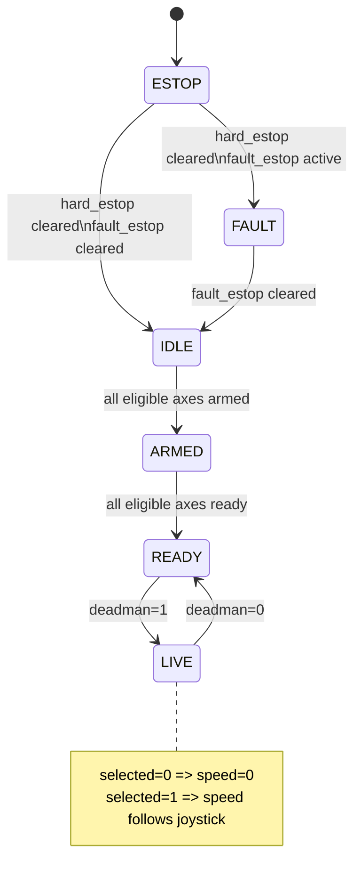

# Steuerung3D Remake

## Architectural Primer (Seams, Services, Plugins) -- Version 4

------------------------------------------------------------------------

## 1. Purpose

This document defines the architectural boundaries of the Steuerung3D
Remake.

It serves as the authoritative reference for:

-   Refactoring decisions
-   Adding new services
-   Introducing new kinematic models
-   Integrating visualization, collision, and sensor systems
-   Supporting alternative hardware buses (CAN, EtherCAT, etc.)
-   Scaling to multi-axis / multi-operator configurations
-   Maintaining deterministic and safety-critical behavior

This document defines structure and authority.\
It intentionally avoids implementation detail.

------------------------------------------------------------------------

## 2. Architectural Overview

The system is structured around a **deterministic Core** surrounded by
loosely coupled **Services**.

-   **Core** = authoritative state machine and safety authority
-   **Plugins** = deterministic in-process transforms
-   **Services** = external processes communicating via defined seams

Only the Core may generate actuator commands.

------------------------------------------------------------------------

## 3. Canonical IPC Seams

All inter-process communication must use one of these seam categories.

  Seam   Direction                          Purpose
  ------ ---------------------------------- -------------------------------
  A      Input Service → Operator Logic     Raw input samples
  B      Operator Stations → Core           Operator intents
  C      Core → Operator Stations / Tools   UI telemetry
  D      Device Adapters → Core             Device telemetry
  E      Core → Device Adapters             Device commands
  F      World/Safety Services → Core       Safety or environmental facts

No new IPC seam category may be introduced without updating this
document.

Physical transports (CAN, EtherCAT, UDP, shared memory, etc.) inside a
service do **not** constitute new seam categories.

------------------------------------------------------------------------

## 4. Core Authority Model

The Core is the single authority for:

-   System mode (synced / unsynced / setup / emergency / estop)
-   Safety gating
-   Collision policy enforcement
-   Constraint enforcement
-   Kinematic mapping
-   Device command generation
-   Telemetry synthesis
-   Lease arbitration

External services may provide information.\
Only the Core may generate actuator commands.

### 4.1 Canonical CoreMode (Stage-2) Safety and Drive State Model

This project uses **one** authoritative global mode model called **CoreMode**.
All components (Core, HiP, device adapters, diagnostics, tests, and docs) must
use **CoreMode**. Legacy/compatibility modes are intentionally not part of the
architecture.

Den-Si local safety logic (including brake grace timing and readiness) remains
authoritative for per-axis safety state; the Core aggregates those facts into a
single global **CoreMode**.

#### 4.1.1 CoreMode states

CoreMode is a finite set of global states:

- **ESTOP**: Any hard E-stop source is active (non-ignorable under current key policy).
- **FAULT**: A resettable E-stop/fault source is active (SafetyPLC already performs latching).
- **IDLE**: Safe, non-moving state used for parameter edits and Resync operations.
- **ARMED**: Axis taster has been activated and brakes may be within a grace period.
- **READY**: Axes are ready to move but Deadman is not held.
- **LIVE**: Deadman is held while READY; movement is permitted (subject to Select gating).

#### 4.1.2 Key policy (per-axis)

Each axis can operate under a key policy that changes which safety sources are considered:

- **Key0 (no key active)**: consider Master, Guider, Network, E-Stop1, E-Stop2 as **hard** sources;  and all other safety bits as **fault/resettable** sources.
- **Key1 active**: ignore **Network** and **TwinSAFE groups** for that axis.
- **Key2 active**: ignore everything ignored by Key1, plus **Guider** and **ENC** for that axis.

Key policy is evaluated per axis based on Den-Si telemetry (e.g., chkEsKey1/chkEsKey2).

#### 4.1.3 Eligible axes for global aggregation

For the *global* CoreMode aggregation, **only axes with Key0 (no key active) are eligible**:

- `eligible_axes = { axis | key_mode(axis) == Key0 }`

Axes with Key1/Key2 are excluded from determining the global CoreMode.  
(Their per-axis safety state still exists and is visible in telemetry/diagnostics.)

If `eligible_axes` is empty, the system must remain in a safe non-moving state
(e.g., **FAULT**) and report an explicit blocked reason (e.g., `NO_KEY0_AXES`).

#### 4.1.4 Combinational CoreMode derivation (no latching in Core)

CoreMode is derived deterministically each tick from the latest aggregated safety facts:

1. **ESTOP** if any eligible axis has an effective *hard* E-stop active.
2. **FAULT** else if any eligible axis has an effective *fault/resettable* E-stop active.
3. **IDLE** else if not all eligible axes are `armed==1`.
4. **ARMED** else if all eligible axes are armed, but not all eligible axes are `ready==1`.
5. **READY** else (all eligible axes ready) and `deadman==0`.
6. **LIVE** if (all eligible axes ready) and `deadman==1`.

Notes:

- The Core does **not** latch fault conditions; SafetyPLC local logic already provides the intended
  reset/latch behavior.
- Transition **READY → LIVE** is driven solely by Deadman.
- Leaving LIVE occurs when Deadman is released (LIVE → READY).

#### 4.1.5 Motion permission gating inside LIVE (Select gating)

CoreMode=LIVE indicates that motion is permitted *in principle*. Actual non-zero motion additionally requires:

- `deadman == 1` (implied by LIVE), and
- `selected == 1` (operator Select)

Policy:

- If `selected == 0`, commanded speed must be treated as **0** (no movement), even while in LIVE.
- Only when `selected == 1` may non-zero speed be applied.

This ensures the operator flow:

`IDLE → (Taster) ARMED → (Brakes ready) READY → (Deadman) LIVE → (Select) non-zero motion allowed`

#### 4.1.6 Mermaid state diagram

------------------------------------------------------------------------

## 5. Deterministic Timebase and Staleness Rules

The Core operates on a single authoritative tick/timebase.

Rules:

-   All safety-relevant messages must carry `tick`.
-   Staleness is defined in **ticks**, not wall-clock time.
-   Core decides staleness policy for:
    -   Device telemetry (Seam D)
    -   Collision facts (Seam F)
    -   Operator sessions
-   When required inputs are stale, Core transitions to a safe state.

Safety-relevant stale data must result in deterministic behavior.

------------------------------------------------------------------------

## 6. Control Pipeline

### In SYNCED FLIGHT mode:

Intent\
→ v_cmd_world\
→ Collision Filter Plugin (mandatory)\
→ v_safe_world\
→ Kinematics Plugin\
→ Device Commands

### In UNSYNCED / SETUP / EMERGENCY modes:

Intent\
→ v_cmd_world\
→ (Collision Filter disabled)\
→ Alternate or direct control path\
→ Device Commands

Mode transitions are owned exclusively by Core.

------------------------------------------------------------------------

## 7. Collision & Safety Architecture

Collision filtering is implemented as a Core plugin consuming Seam F
facts.

If required Seam F data is stale in SYNCED mode:

`v_safe_world = 0`

A non-modal warning must be emitted.

------------------------------------------------------------------------

## 8. Kinematics Architecture

Kinematics is a **Core plugin**.

-   Deterministic
-   No IPC
-   Runs inside Core tick loop
-   Independent of visualization implementation

It maps:

`v_safe_world → per-axis command rates`

------------------------------------------------------------------------

## 9. Transport vs Protocol vs Schema

A seam defines a **message schema**, independent of transport.

Rules:

-   Core speaks only canonical internal schemas.
-   Device Adapters translate between physical protocols (PLC, CAN,
    etc.) and canonical schemas.
-   Transport (UDP, CAN, etc.) is an implementation detail of services.
-   Schema evolution must preserve backward compatibility or be
    versioned.

------------------------------------------------------------------------

## 10. Operator Roles and Leases

Two operational roles exist:

### Pilot

-   Consumes: C2 (Rig Telemetry)
-   Produces: Rig-level intents (Seam B)
-   Requires: `lease_rig`

### Flight Technician (FT)

-   Consumes: C2 (Rig Telemetry)
-   Produces: Axis-level intents (Seam B)
-   Requires: `lease_axis[axis]` per actuator

### Lease Rules

-   `lease_rig` is exclusive.
-   `lease_axis[axis]` is per actuator.
-   Core enforces lease policy.
-   Role switching is controlled by Core, not UI.

------------------------------------------------------------------------

## 11. Telemetry Streams (Seam C)

Seam C may include:

-   **C2 Rig Telemetry** (authoritative global snapshot)
-   **C1 Axis Telemetry** (optional detailed slices)

C2 is mandatory for distributed operation.

------------------------------------------------------------------------

## 12. Telemetry Distribution -- Unicast Fanout

Seam C uses **unicast fanout**:

-   Each consumer binds its own `telem_in` endpoint.
-   Core sends telemetry to each endpoint.

Multiple processes must not rely on binding the same UDP port.

Bind vs target must be explicit in configuration.

------------------------------------------------------------------------

## 13. Device Adapter Model

Device Adapters:

-   Consume Seam E (commands)
-   Produce Seam D (telemetry)
-   May represent one or many actuators
-   Translate between canonical schema and physical protocol

------------------------------------------------------------------------

## 14. Transaction and Idempotency Rules

-   Intents must be idempotent or transactional.
-   Requests requiring acknowledgment must include `req_id`.
-   Core must tolerate duplicates safely.
-   Edit sessions must be time-bounded and Core-owned.

------------------------------------------------------------------------

## 15. Failure and Degraded Mode Policy

-   Services may crash independently.
-   Core must tolerate service restart.
-   Stale device telemetry triggers safe behavior.
-   Safety-critical failures must produce deterministic fallback.

------------------------------------------------------------------------

## 16. Configuration Authority

-   The CLI stack runner is the single blessed boot path.
-   Profiles define topology.
-   All wiring must respect seam categories A--F.
-   Bind and target must be explicit.

------------------------------------------------------------------------

## 17. Logging and Performance Rules

-   Logging must not degrade control responsiveness.
-   High-rate logs default to DEBUG.
-   INFO level reserved for operator-relevant state transitions.
-   Session-local logs preferred unless aggregation is explicitly
    required.

------------------------------------------------------------------------

## 18. Security Boundary (Minimal Assumption)

-   System assumes trusted network by default.
-   On untrusted networks, seams must be protected (VPN, firewall,
    allowlists).
-   Core must not accept commands from unknown sources.

------------------------------------------------------------------------

## 19. Refactoring Rule

Any refactoring must preserve:

-   Seam boundaries
-   Core authority
-   Mode gating logic
-   Plugin vs service separation
-   Deterministic control pipeline ordering
-   Unicast fanout model
-   Timebase and staleness guarantees

If a change violates one of these, this document must be updated first.
