# Steuerung3d_Remake – Structure & Dependency Graph (auto-generated)

This file was generated from `dev-main.zip` by scanning Python import statements under `src/steuerung3d/`.

## Entry points (module runners)

Run these from the repo root after installing editable (`pip install -e .`) or by setting `PYTHONPATH=src`:

- `python -m steuerung3d.apps.yellow`
- `python -m steuerung3d.apps.plc_sim`
- `python -m steuerung3d.apps.plc_sim_ui`
- `python -m steuerung3d.apps.core_service`
- `python -m steuerung3d.apps.core_udp_service`
- `python -m steuerung3d.apps.cli_client`
- `python -m steuerung3d.apps.log_viewer`
- `python -m steuerung3d.apps.replay_player`
- `python -m steuerung3d.apps.plc_stack`
- `python -m steuerung3d.apps.dev_stack`
- `python -m steuerung3d.apps.hi_p`
- `python -m steuerung3d.apps.den_si`

Developer utility scripts live under `tools/` (for example `tools/run_stack_2win.py`).


## Package-level dependencies

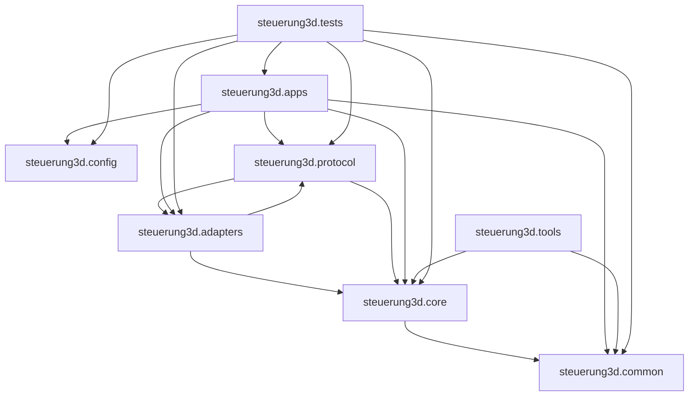

**Note:** There is one import cycle at the package level: `steuerung3d.protocol` ↔ `steuerung3d.adapters`
(coming specifically from `protocol.udp_channels` importing `adapters.links.udp_link`, while legacy PLC code imports protocol utilities).

## Apps and what they depend on

python -m steuerung3d.apps.yellow
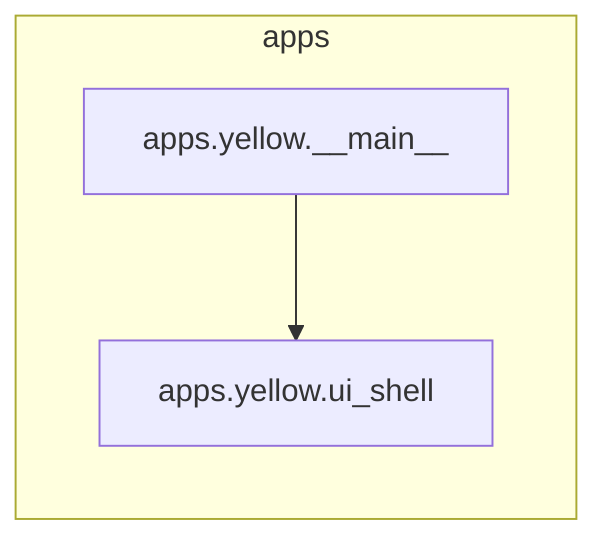

python -m steuerung3d.apps.plc_sim
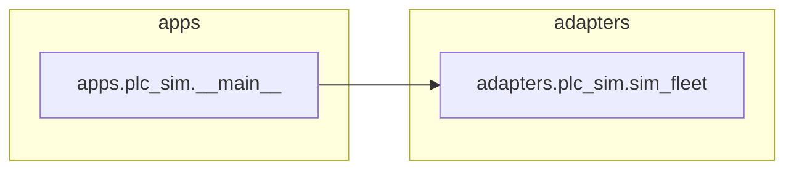

python -m steuerung3d.apps.plc_sim_ui
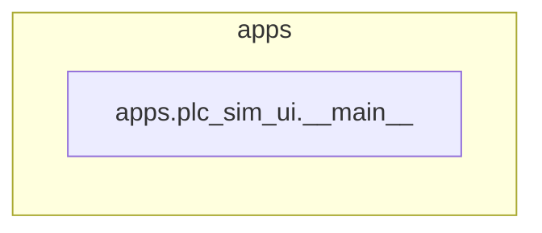

python -m steuerung3d.apps.core_service
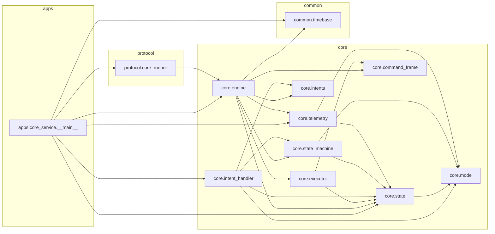

python -m steuerung3d.apps.core_udp_service
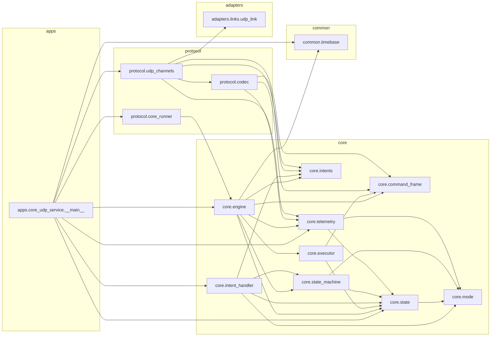

python -m steuerung3d.apps.cli_client
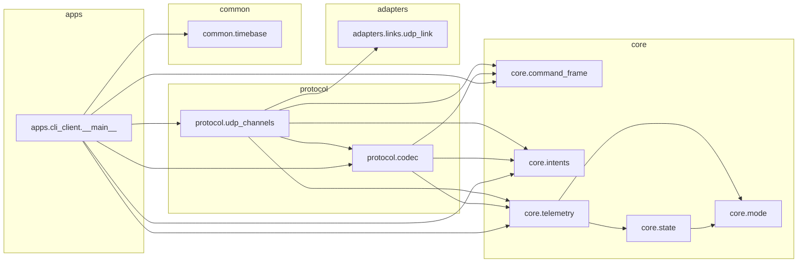

python -m steuerung3d.apps.log_viewer
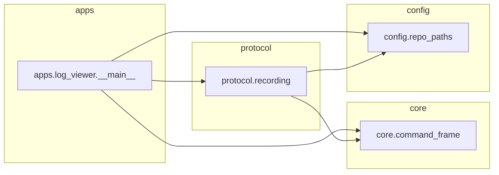

python -m steuerung3d.apps.replay_player
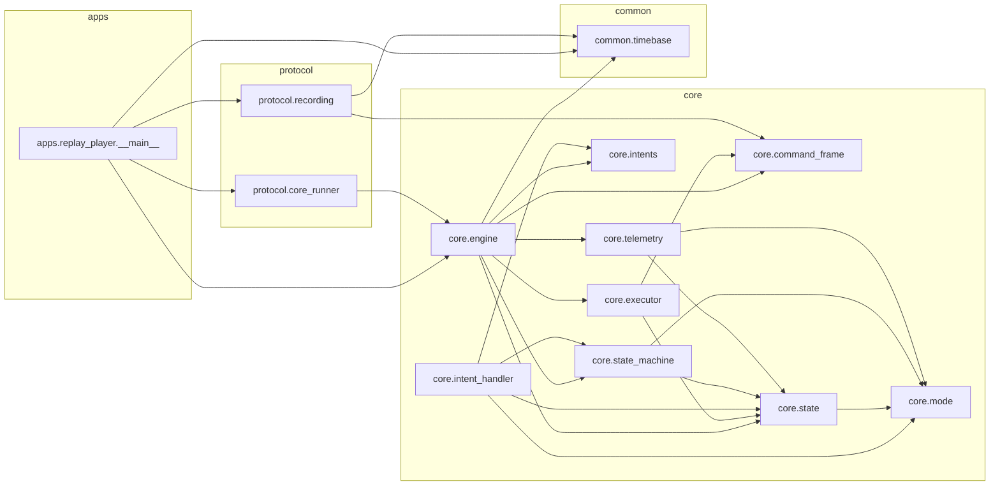

python -m steuerung3d.apps.plc_stack
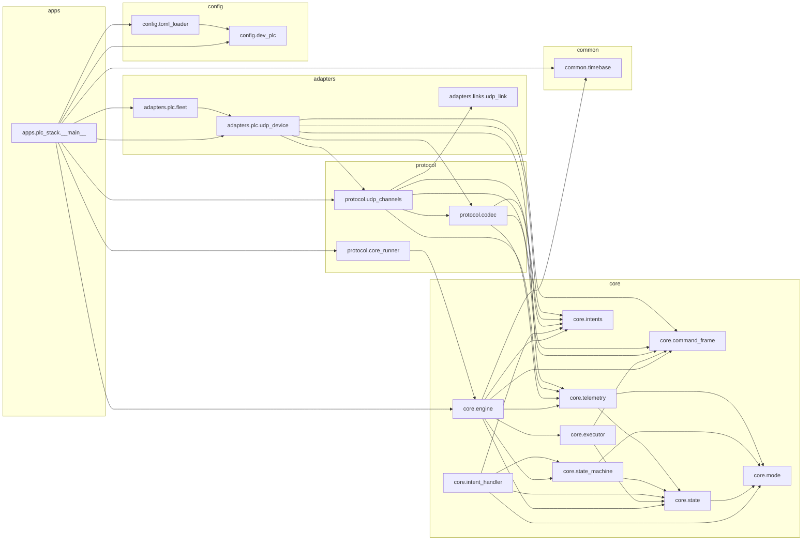

python -m steuerung3d.apps.dev_stack
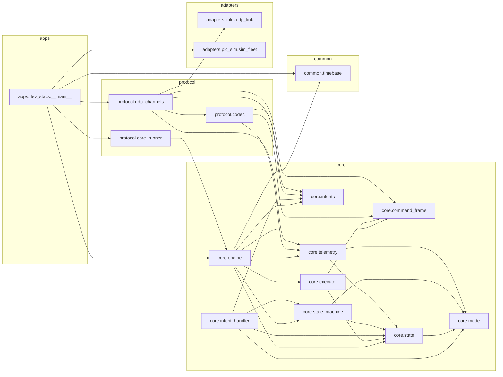

python -m steuerung3d.apps.hi_p
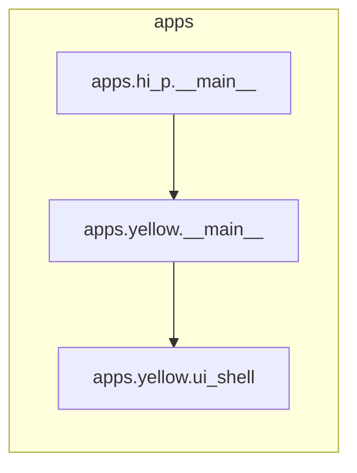

python -m steuerung3d.apps.den_si
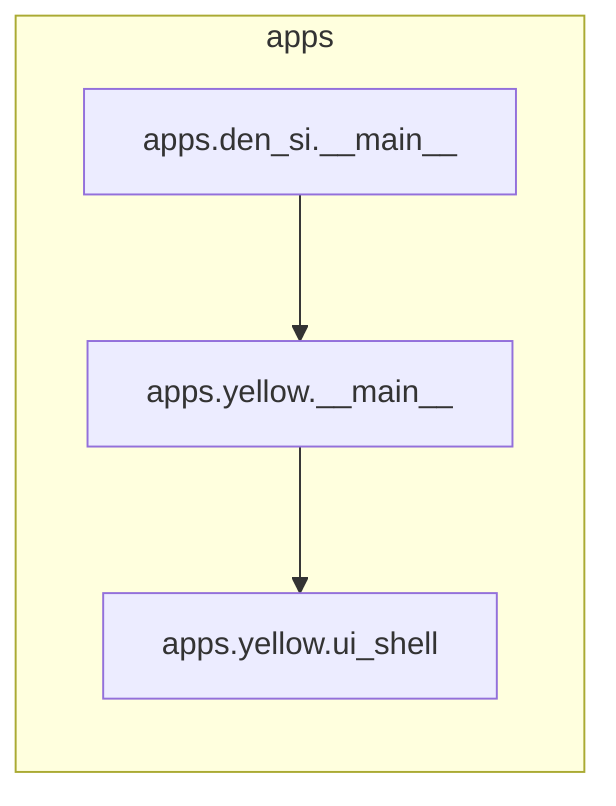
## Adapter subpackages

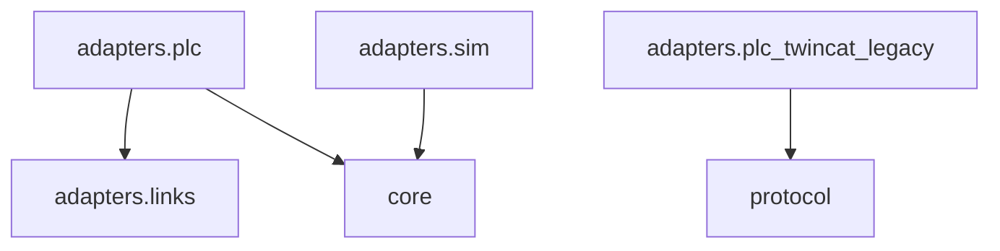

## Runtime flow (typical “core_udp_service” deployment)

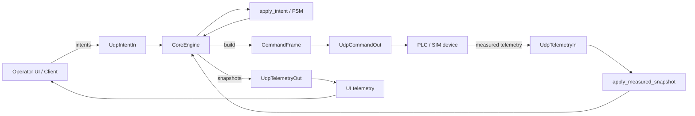
## one tick” sequence diagram (Obsidian-safe)
```mermaid
sequenceDiagram
  participant UI as UI client
  participant II as UdpIntentIn
  participant CR as CoreRunner
  participant CE as CoreEngine
  participant IH as apply_intent
  participant CF as build_command_frame
  participant CO as UdpCommandOut
  participant PLC as PLC or SIM
  participant TI as UdpTelemetryIn
  participant AMS as apply_measured_snapshot
  participant TO as UdpTelemetryOut

  UI->>II: UDP intent packet
  CR->>II: drain_intents
  II-->>CR: intents list

  CR->>CE: step_once dt
  CE->>IH: apply_intent for each
  IH-->>CE: updated state

  CE->>CF: build CommandFrame from state
  CF-->>CE: cmd_frame

  CE->>CO: publish cmd_frame
  CO->>PLC: UDP cmd packet

  PLC->>TI: UDP telemetry packet
  CE->>TI: drain_telemetry
  TI-->>CE: telemetry snapshots
  CE->>AMS: apply last snapshot to state
  AMS-->>CE: state merged

  CE->>TO: publish snapshot
  TO-->>UI: UDP telemetry for UI
  ```

##  “Boots on floor” view of threads and buffers

Most of your code is intentionally simple: it avoids complicated async and uses non-blocking drains each tick.

So you effectively have:

One main thread doing ticks

Kernel UDP buffers acting as the queue

Optional: logging/recording append (file IO)

```mermaid
flowchart LR
  UI["UI process"] -->|UDP intents| UDP1["kernel UDP recv buffer"]
  PLC["PLC or SIM"] -->|UDP telemetry| UDP2["kernel UDP recv buffer"]

  subgraph CORE["core_udp_service process"]
    CR["protocol.core_runner loop"]
    CE["core.engine"]
    II["UdpIntentIn"]
    TI["UdpTelemetryIn"]
    CO["UdpCommandOut"]
    TO["UdpTelemetryOut"]
    AMS["core.telemetry.apply_measured_snapshot"]
  end

  UDP1 --> II --> CR --> CE
  UDP2 --> TI --> CE --> AMS --> CE
  CE --> CO -->|UDP commands| PLC
  CE --> TO -->|UDP telemetry| UI
  ```

  What exactly is “apply_measured_snapshot” doing

At the grunt level, it’s not mystical — it is basically:

validate snapshot is sane

for each axis:

update measured position, velocity, status bits

update “online/ready/brakes” indicator fields

maybe compute diffs like pos_diff = cmd_pos - meas_pos

set global fields like last_update_ts, device_alive

That’s why it’s clean as a standalone function: it has one job:
merge external truth into the canonical MachineState.

The core engine owns canonical state; the device hook decides when and from where to update it.

Two common “gotchas” you’ll run into
1) Telemetry burst vs tick frequency

If PLC emits telemetry faster than your tick rate, each tick you may drain multiple packets.
Your current policy (“take the latest snapshot”) is totally fine, but you should be aware:

Dropping intermediate snapshots is intentional (prevents backlog)

if you need velocity integration or event detection, you might need to process all

2) Intent ordering vs telemetry ordering

You have two independent streams:

intents from UI

telemetry from device

There is no guarantee they line up by timestamps unless you add sequence numbers.

So you pick a simple deterministic policy:

drain all intents at start of tick

compute command

then merge latest telemetry after send

That yields the stable “one tick latency” model.

1) What the entrypoint wires up
UDP endpoints (hardcoded in core_udp_service)

Operator → Core (intents): UdpIntentIn.bind(("127.0.0.1", 51001))

Core → Operator (telemetry): UdpTelemetryOut.connect(("127.0.0.1", 51002))

Core → Device (command frames): UdpCommandOut.connect(("127.0.0.1", 52001))

Device → Core (telemetry): UdpTelemetryIn.bind(("127.0.0.1", 52002))

Each channel is JSON-over-UDP using UdpLink:

socket is non-blocking

poll(limit=N) drains whatever is already in the kernel receive buffer

Core wiring

The app creates:

Timebase(dt_s=args.dt) (default --dt 0.1)

MachineState() then ensure_axis("X") and ensure_axis_cmd("X")

closures:

drain_intents() → drains UDP intents

device_step(state, cmd_frame, dt) → sends cmd + drains telemetry + applies it

on_snapshot(snap) → sends telemetry to UI

CoreEngine(...hooks...)

CoreRunner(engine=eng, realtime=True) → runs in a background thread

2) The actual tick loop (call order)

This is the real sequence in CoreEngine.step_once():

dt = timebase.dt_s

Drain & apply intents

for intent in drain_intents(): handle_intent(state, intent)

in your entrypoint, handle_intent = apply_intent

Enforce invariants / safety clamps

enforce_mode_actions(state)
(ESTOP / FAULT / IDLE clamp axis cmd velocities/enables)

Advance time deterministically

state.tick += 1

state.t_s = state.tick * dt

Build the outgoing CommandFrame

cmd_frame = build_command_frame(state)

Device step hook

device_step(state, cmd_frame, dt)

(this is where UDP send + telemetry drain + apply happens)

Clear one-shot requests

state.clear_one_shots()  # clears per-axis reset/resync/param requests

Emit telemetry snapshot

on_snapshot(TelemetrySnapshot.from_state(state))

entrypoint sends it to UI via UdpTelemetryOut

## Boots” diagram: per-tick call stack (Obsidian-safe)

```mermaid
flowchart TD
  R["CoreRunner._run_loop()"]
  E["CoreEngine.step_once()"]

  A["drain_intents()  (UdpIntentIn.drain_intents)"]
  B["apply_intent(state,intent)"]
  C["enforce_mode_actions(state)"]
  D["advance tick + t_s"]
  F["build_command_frame(state)"]
  G["device_step(state,cmd_frame,dt)"]
  H["clear one-shots via state.clear_one_shots()"]
  I["TelemetrySnapshot.from_state(state)"]
  J["on_snapshot(snap)  (UdpTelemetryOut.publish_telemetry)"]

  R --> E
  E --> A --> B --> C --> D --> F --> G --> H --> I --> J
  ```

  3) What device_step() actually does (and why apply_measured_snapshot is “not in CoreEngine”)

Your entrypoint defines:

send the command frame

dev_cmd_out.publish_command_frame(cmd_frame)

drain device telemetry

snaps = dev_telem_in.drain_telemetry(limit=50)

apply latest snapshot into MachineState

apply_measured_snapshot(state, snaps[-1])

So: apply_measured_snapshot() is not a method, but it runs inside the engine tick via the injected hook.

This is the “grunts truth”: CoreEngine is the tick orchestrator, but IO/transport policy lives in the entrypoint hook.

## Boots” diagram: device_step() internals
```mermaid
flowchart LR
  DS["device_step(state, cmd_frame, dt)"]

  CO["UdpCommandOut.publish_command_frame(cmd_frame)"]
  TX["JSON encode (codec.encode_command_frame)"]
  US["UdpLink.send() -> UDP 127.0.0.1:52001"]

  TI["UdpTelemetryIn.drain_telemetry(limit=50)"]
  RX["UdpLink.poll() nonblocking recvfrom"]
  DJ["json.loads + codec.decode_telemetry"]
  AMS["apply_measured_snapshot(state, latest_snap)"]

  DS --> CO --> TX --> US
  DS --> TI --> RX --> DJ --> AMS
  ```
  4) The data shapes on the wire (real JSON payloads)

Everything uses dataclasses.asdict() for encoding, so field names match the dataclasses.

Intents (UI → Core on 51001)

Decoded by codec.decode_intent() using "type" dispatch.

Examples:

EnableAxis: {"type":"enable_axis","axis_id":"X","enable":true}

JogAxis: {"type":"jog_axis","axis_id":"X","vel":0.2}

CoreMode is derived from safety facts; there is no intent to set LIVE/IDLE.

ClearFault: {"type":"clear_fault"}

RequestEstopReset: {"type":"estop_reset"}

SetEstop: {"type":"set_estop","estop":true}

CommandFrame (Core → Device on 52001)

Built by build_command_frame(state):

Important details from your executor:

estop in the frame is always False (estop=False # important policy change)

estop_reset is a one-tick pulse (state flag cleared after device_step)

Shape:

{
  "tick": 123,
  "t_s": 12.3,
  "estop": false,
  "fault": false,
  "core_mode": "LIVE",
  "axes": {
    "X": {"enable": true, "vel": 0.2}
  },
  "estop_reset": false
}

TelemetrySnapshot (Device → Core on 52002, and Core → UI on 51002)

TelemetrySnapshot includes:

tick, t_s, core_mode, estop, fault

per-axis: pos, vel, enabled, fault

plus estop_status_word (carried through)

Shape:

{
  "tick": 123,
  "t_s": 12.3,
  "core_mode": "IDLE",
  "estop": false,
  "fault": false,
  "axes": {
    "X": {"pos": 1.2, "vel": 0.0, "enabled": true, "fault": false}
  },
  "estop_status_word": 0
}

5) The timing reality: the one-tick latency (what you observed)

Because the order is:

apply intents

enforce core_mode clamps

advance tick

build command frame

send command

drain telemetry

apply telemetry to state

snapshot to UI

…your command at tick k is based on the state as of the end of tick k-1 (plus any intents applied at start of tick k). Telemetry received during tick k affects command generation in tick k+1.

That’s not a bug — it’s a clean deterministic tick model.

```mermaid
sequenceDiagram
  participant UI as UI_operator_client
  participant II as UdpIntentIn_51001
  participant R as CoreRunner_thread
  participant E as CoreEngine_step_once
  participant SM as IntentHandler_and_ModeClamps
  participant EX as BuildCommandFrame
  participant CO as UdpCommandOut_52001
  participant PLC as Device_PLC_or_SIM
  participant TI as UdpTelemetryIn_52002
  participant AMS as ApplyMeasuredSnapshot
  participant TO as UdpTelemetryOut_51002

  UI->>II: send intent packet (JSON)
  R->>E: call step_once
  E->>II: drain_intents
  II-->>E: intents list

  E->>SM: apply_intent for each intent
  E->>SM: enforce_mode_actions on state
  E->>E: advance tick and compute t_s
  E->>EX: build command frame from state
  EX-->>E: command frame
  E->>CO: publish command frame
  CO->>PLC: UDP command packet (JSON)

  PLC->>TI: UDP telemetry packet (JSON)
  E->>TI: drain_telemetry
  TI-->>E: telemetry snapshots
  E->>AMS: merge latest telemetry into state
  E->>TO: publish telemetry snapshot to UI
  TO-->>UI: UDP telemetry packet (JSON)
  ```